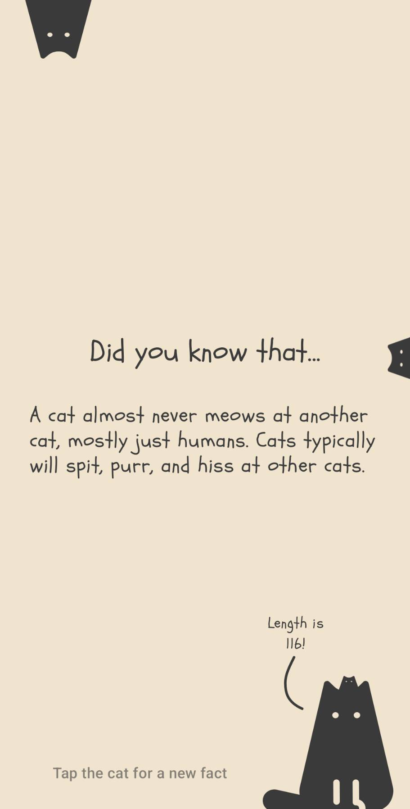
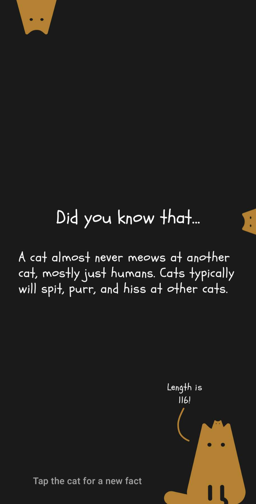

# Cat Fact App

    
    

_A sample video is available in the samples directory._

## Description
An app that shows a new random fact about cats everytime you tap the screen. 

### Changes from requirements
- design and font has been changed (see design process below)
- instead of a button, tapping the cat at the bottom will show a new cat fact
- instead of showing a text that says "Multiple Cats!", the app literally shows multiple cats
- Room is used instead of Datastore to keep a local database of cat facts
  - Datastore is more for key-value storage, like for user preferences
  - the reason behind this is that it can be extended in the future to allow users to browse 
    past cat facts

## Architecture
### Data Layer

**Network Module**
- contains the network client that makes requests to a given remote endpoint
- Ktor has been selected for the implementation of the network client for its ease of use in Kotlin and extreme flexibility
- returns data wrapped in NetworkResponse that indicates either a success or failure

**Service Module**
- contains all the api calls used in the app
- currently only CatFactService is available, but can be extended in the future to add more endpoints

**Database Module**
- module for storing remote data locally
- uses Room
- currently only contains DAO for cat facts, but can be extended to add more DAOs

**Repository Module**
- in charge of transforming data from various data sources to models used throughout the app
- repositories are the main interface that the rest of the app will work with
- local data source is used as the single source of truth, while fetching from the remote data source will only update the local data source

### Domain Layer
- contains common use cases used throughout the app
- at the moment, there is only one use case: check if a fact should show the length and if it contains the word "cats"

### UI Layer

**Core Module**
- contains common ui components and themes

**Fact Module**
- main module for the fact feature

## Design Process
An app that shows cat facts is meant to be fun and light-hearted. Therefore, the font and color choices reflect that, almost as if a child wrote the fact and designed the app. Elements chosen for the UI were also meant to enhance the playfulness of the app, such as:
- tapping the cat at the bottom will show a new fact.
- if the length is greater than 100, the cat is the one that tells you that
- if the word "cats" shows up in the facts, multiple cats will literally pop into the screen

## Improvements
- error handling for network requests
- allow user to view past cat facts
- animation fine-tuning
- add more tests (currently domain layer contains some tests)
